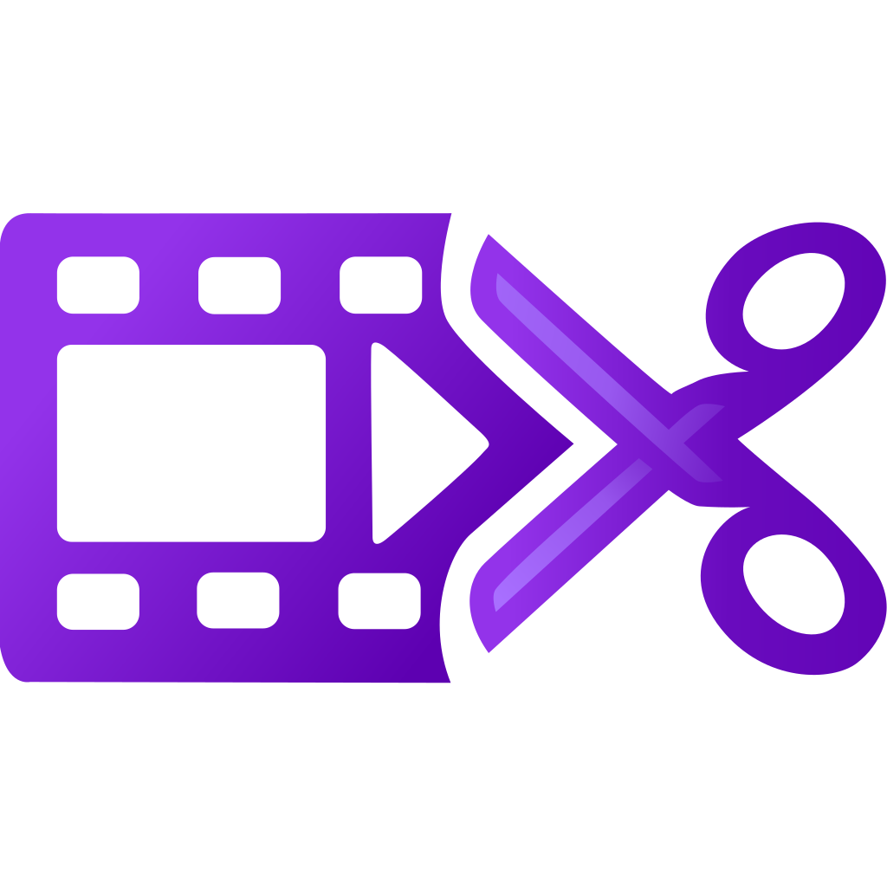

  

# Clipfolio - A video clip manager

A desktop app for managing and editing your video clips. Trim, adjust audio, and compress clips for easy sharing on platforms like Discord.

> **Note:** Clipfolio is for editing existing videos - it doesn't record or capture footage.

## What it does

- **Clip library** - All your clips in one place with auto-generated thumbnails
- **Non-destructive editing** - Trim and adjust audio without touching the original files
- **Favorites** - Star the clips you like and filter by favorites
- **Multi-track audio** - Adjust volume for each audio track separately
- **Export** - Export and download edited clips
- **Discord sharing** - Compress clips to 10MB and drag-and-drop directly into Discord

**[Download Latest Release](https://github.com/Timbergh/clipfolio/releases/latest)**

## License

MIT
